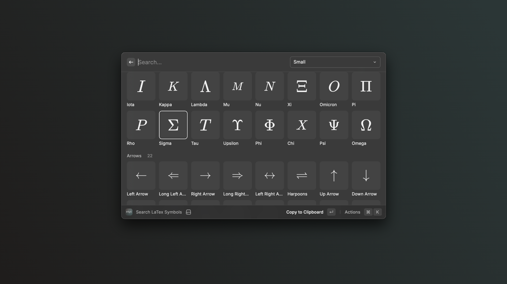

  
  <h1 align="center">Raycast LaTeX</h1>

A [Raycast](https://www.raycast.com/) extension that allows you to quickly search for and preview LaTeX symbols and math expressions from anywhere in your workflow.

### Features

- [x] Quick search and find LaTeX symbols.
- [ ] Live previews of math expressions

### Author

Developed by **Elian Paredes**

### License

Licensed under the [MIT License](LICENSE).
